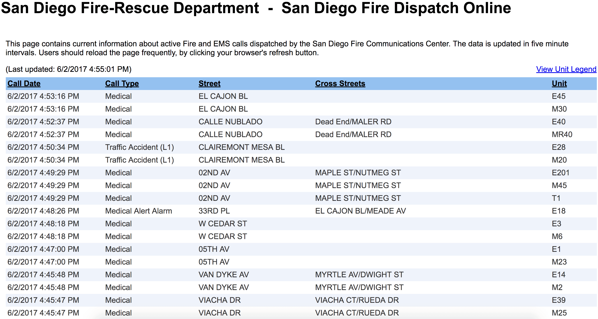
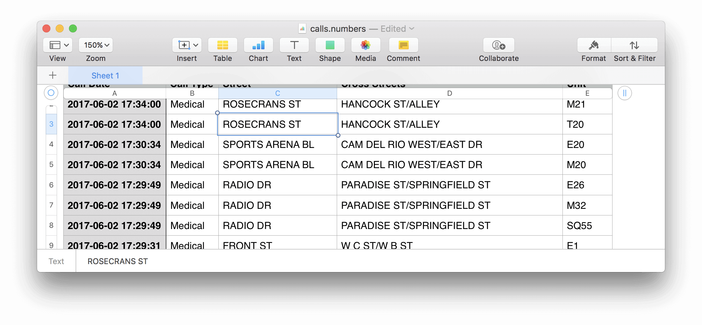

---  
author: Hoang Trinh  
date: 2019-12-25 08:43:00+00:00  
layout: post  
slug: easiest-way-scrape-data-with-python
title: The easiest way to scrape data in a web page with Python
thumbnail: '../thumbnails/python.png'  
template: post  
categories:  
 - Python
 - Pandas
 - Data Mining
tags:  
 - python
 - pandas
 - data-mining
---  

Let’s say you are searching the web for some raw data you need for a project and you stumble across a webpage like this:



You found exactly what you need — an up-to-date page with exactly the data you need!

But the bad news is that the data lives inside a web page and there’s no API that you can use to grab the raw data. So now you have to waste 30 minutes throwing together a crappy script to scrape the data. It’s not hard, but it’s a waste of time that you could spend on something useful. And somehow 30 minutes always ends up being 2 hours.

For me, this kind of thing happens all the time.


Luckily, there’s a super simple answer. The Pandas library has a built-in method to scrape tabular data from html pages called `read_html()`:

```python
import pandas as pd

tables = pd.read_html("https://apps.sandiego.gov/sdfiredispatch/")

print(tables[0])
```

It’s that simple! Pandas will find any significant html tables on the page and return each one as a new `DataFrame` object.

To upgrade our program from toy to real, let’s tell Pandas that row 0 of the table has column headers and ask it to convert text-based dates into time objects:

```python
import pandas as pd

calls_df, = pd.read_html("http://apps.sandiego.gov/sdfiredispatch/", header=0, parse_dates=["Call Date"])

print(calls_df)
```

Which gives you this beautiful output:

```shell

             Call Date        Call Type              Street                             Cross Streets    Unit
0  2017-06-02 17:27:58          Medical         HIGHLAND AV                 WIGHTMAN ST/UNIVERSITY AV     E17
1  2017-06-02 17:27:58          Medical         HIGHLAND AV                 WIGHTMAN ST/UNIVERSITY AV     M34
2  2017-06-02 17:23:51          Medical          EMERSON ST                    LOCUST ST/EVERGREEN ST     E22
3  2017-06-02 17:23:51          Medical          EMERSON ST                    LOCUST ST/EVERGREEN ST     M47
4  2017-06-02 17:23:15          Medical         MARAUDER WY                     BARON LN/FROBISHER ST     E38
5  2017-06-02 17:23:15          Medical         MARAUDER WY                     BARON LN/FROBISHER ST     M41
```

And how that the data lives in a `DataFrame`, the world is yours. Wish the data was available as json records? That’s just one more line of code!

```python
import pandas as pd

calls_df, = pd.read_html("http://apps.sandiego.gov/sdfiredispatch/", header=0, parse_dates=["Call Date"])

print(calls_df.to_json(orient="records", date_format="iso"))
```

If you run that, you’ll get this beautiful json output (even with proper `ISO 8601` date formatting!):

```json
[
  {
    "Call Date": "2017-06-02T17:34:00.000Z",
    "Call Type": "Medical",
    "Street": "ROSECRANS ST",
    "Cross Streets": "HANCOCK ST/ALLEY",
    "Unit": "M21"
  },
  {
    "Call Date": "2017-06-02T17:34:00.000Z",
    "Call Type": "Medical",
    "Street": "ROSECRANS ST",
    "Cross Streets": "HANCOCK ST/ALLEY",
    "Unit": "T20"
  },
  {
    "Call Date": "2017-06-02T17:30:34.000Z",
    "Call Type": "Medical",
    "Street": "SPORTS ARENA BL",
    "Cross Streets": "CAM DEL RIO WEST/EAST DR",
    "Unit": "E20"
  }
  // etc...
]
```

You can even save the data right to a CSV or XLS file:

```python
import pandas as pd

calls_df, = pd.read_html("http://apps.sandiego.gov/sdfiredispatch/", header=0, parse_dates=["Call Date"])

calls_df.to_csv("calls.csv", index=False)
```

Run that and double-click on `calls.csv` to open it up in your spreadsheet app:



And of course Pandas makes it simple to filter, sort or process the data further:

```shell
>>> calls_df.describe()

                  Call Date Call Type      Street           Cross Streets Unit
count                    69        69          69                      64   69
unique                   29         2          29                      27   60
top     2017-06-02 16:59:50   Medical  CHANNEL WY  LA SALLE ST/WESTERN ST   E1
freq                      5        66           5                       5    2
first   2017-06-02 16:36:46       NaN         NaN                     NaN  NaN
last    2017-06-02 17:41:30       NaN         NaN                     NaN  NaN

>>> calls_df.groupby("Call Type").count()

                       Call Date  Street  Cross Streets  Unit
Call Type
Medical                       66      66             61    66
Traffic Accident (L1)          3       3              3     3

>>> calls_df["Unit"].unique()

array(['E46', 'MR33', 'T40', 'E201', 'M6', 'E34', 'M34', 'E29', 'M30',
       'M43', 'M21', 'T20', 'E20', 'M20', 'E26', 'M32', 'SQ55', 'E1',
       'M26', 'BLS4', 'E17', 'E22', 'M47', 'E38', 'M41', 'E5', 'M19',
       'E28', 'M1', 'E42', 'M42', 'E23', 'MR9', 'PD', 'LCCNOT', 'M52',
       'E45', 'M12', 'E40', 'MR40', 'M45', 'T1', 'M23', 'E14', 'M2', 'E39',
       'M25', 'E8', 'M17', 'E4', 'M22', 'M37', 'E7', 'M31', 'E9', 'M39',
       'SQ56', 'E10', 'M44', 'M11'], dtype=object)
```

None of this is rocket science or anything, but I use it so often that I thought it was worth sharing. Have fun!
