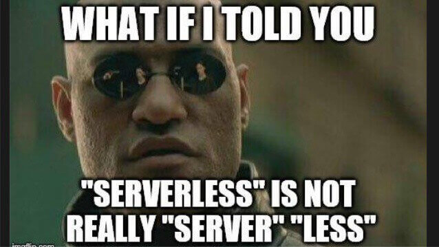

---  
author: Hoang Trinh  
date: 2019-12-30 09:17:00+00:00
layout: post  
slug: why-use-serverless
title: Why should you use serverless?
thumbnail: '../thumbnails/cloudPlatform.png'  
template: post  
categories:  
 - Cloud Platform
 - Architecture
tags:  
 - cloud-platform
 - architecture
---

The Myths and Misconceptions About Serverless and why you should consider going serverless

The demand for serverless computing solutions is growing. But before we go any further, let’s try to explain what this relatively new phenomenon is. The name serverless is pretty contradictory. No, serverless doesn’t mean that there’s no server involved. There has to be a server somewhere, of course. How else would we be able to do any computing?

So what is serverless? This is what Wikipedia says:

> “Serverless computing is a cloud-computing execution model in which the cloud provider runs the server, and dynamically manages the allocation of machine resources.”

The description that I like the most comes from Gojko Adzic. 

> He says that serverless is serverless in the way that WiFi is wireless. Because even with WiFi, there are still a lot of cables involved. Once you connect wirelessly to a network, you don’t think about all the cables that connect routers, etc.

The same thing goes for serverless. Even though there are still servers running your code, you don’t have to think about those servers.

In my product [PerformFlow](https://gsuite.google.com/marketplace/app/performflow_form_publisher_approvals_wor/175817313914), I also use Firebase (Google) Cloud Functions to handle requests from users.

And although we have nearly 90 thousands users (at the moment of writing this post), it costs only about 0.5$ per month. It's so cheap, I'm not sure if Google can make any profit from this.

---

## Why Serverless?
There are several reasons why you should consider going serverless.

### Scalable
Imagine a situation where a post office could somehow magically add and decommission delivery trucks at will. Around Valentine's Day, when the mail spikes, the post office could increase the number of delivery trucks. On the other hand, the number of delivery trucks could be decreased for times when fewer deliveries are necessary. That’s essentially what serverless applications are able to do.

As a developer, you don’t have to think about scaling when you’re going serverless since it happens automatically.

### No need to manage servers
With serverless, there’s no need to worry about how to patch a server for the latest security update or other maintenance tasks that need to be done.

This leaves more time to focus on actually producing code and working on the core business. Besides that, you don’t need to hire someone who has the expertise to manage the servers.

This will save you time and money, which are valuable assets for every business.

### Cheaper
You don’t have to pay for idle servers — you only pay when the server is actually doing something. In other words, if there’s no code running on the servers, you don’t have to pay.

Since most servers aren’t actively doing something for a big part of the time, going serverless can save a lot of money. In some cases, costs can be reduced by 90%.

However, performance can be hurt a little bit by going serverless. Because it’s not constantly running, serverless code may need to ‘boot up’ when it’s used. This startup time may degrade performance. This is what is called a ‘cold start.’

If a piece of code is used regularly, though, the serverless provider will keep it ready to be activated. This is called a ‘warm start,’ which doesn’t hurt the performance.

### Fast and more controlled deployment
With serverless, there’s no need to upload code to a server in order to release a new version of the product. Developers can very quickly upload small bits of code and release a new version of the product. Code can be uploaded all at once or one function at a time. This is possible since the application is a collection of functions, instead of one big chunk of code.

This makes it possible to quickly update, patch, fix, or add new features to the product. Developers can update the application one function at a time, which gives them much more control over the deployment.

### Secure
The vendor takes care of the security of the system and the network configuration around the servers that run your code. When a meltdown happens, the vendor will patch all of its servers, and you won’t even have to think about them.

### Overall
Overall, we could say that serverless leaves fewer ops responsibilities on the developer team’s shoulders, which means more time to work on things that actually make a difference to the customer.

---

## Myths and Misconceptions
Serverless is still maturing, which is why there are a lot of myths and misconceptions about how it actually works.

### 1: Cold starts happen on every request
People often tend to overplay the role of a cold start. Cold starts don’t happen on every request. Resources are reused where possible. A cold start will only happen when no container is running with your piece of code.

### 2: Price raising
One of the most commonly asked questions about the costs of serverless is: But what if Amazon decides to raise the price of Lambda? This is probably a fair concern, but it’s pretty ignorant to the market forces. If the price of Lambda is raised, the customers will probably move to their competitor.

Besides that, historically, the data does not support that this is a thing. Amazon announced 67 price reductions in the last five years and zero price hikes.

### 3: Serverless costs more
Serverless might cost you just as much, or even more, but you get so much more done. There’s no need to invest any time and resources into maintaining servers. You don’t need to spend money on a salary for someone that has the knowledge to maintain these servers.

The amount of ops work that developers have to do is reduced, giving them have way more time to produce code. So even if it costs more money, more time can be spent on working on customer needs.

Thank you for reading !
