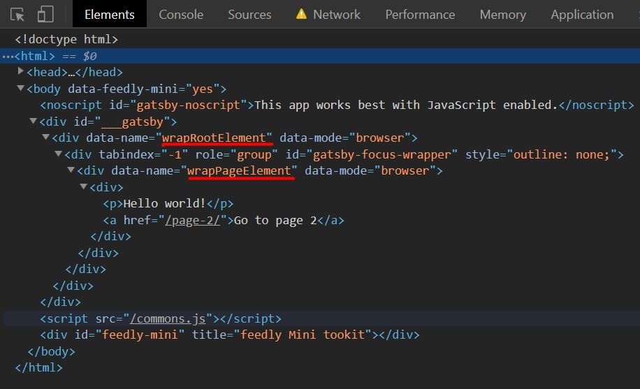

According to Gatsby documentation, you can use [wrapRootElement](https://www.gatsbyjs.org/docs/browser-apis/#wrapRootElement) to wrap your application with provider components and [wrapPageElement](https://www.gatsbyjs.org/docs/browser-apis/#wrapPageElement) to wrap your pages with components that won’t get unmounted on page change. But that explanation begs the question: why we don’t do both with `wrapPageElement`, and instead, we need two separate APIs to accomplish those tasks? Let’s see their _differences_ to understand why.

## Differences

First of all, `wrapPageElement` is a child of `wrapRootElement` as you can see in the following image:



Additionally, [wrapPageElement is a child of the router](https://github.com/gatsbyjs/gatsby/issues/10688#issuecomment-450353014) — `wrapRootElement` is not — so it has access to the router props. You can access those props if you destructure the `props` field from the first argument:

```javascript
// gatsby-browser.js or gatsby-ssr.js
import React from 'react'
import Layout from './src/layout'

// Wraps every page in a component
export const wrapPageElement = ({ element, props }) => {
  return <Layout {...props}>{element}</Layout>
}
```

> If you got error `exports is not defined`, try to use both import/export in `gatsby-browser.js` and `gatsby-ssr.js`.
>
> Check this issue here: [https://github.com/gatsbyjs/gatsby/issues/4452](https://github.com/gatsbyjs/gatsby/issues/4452)

In the following snippet you can see an example of that `props` field:

```json
{
  "path": "/",
  "location": {
    "href": "http://localhost:8001/",
    "ancestorOrigins": {},
    "origin": "http://localhost:8001",
    "protocol": "http:",
    "host": "localhost:8001",
    "hostname": "localhost",
    "port": "8001",
    "pathname": "/",
    "search": "",
    "hash": "",
    "state": null,
    "key": "initial"
  },
  "pageResources": {
    "json": {
      "pageContext": {
        "isCreatedByStatefulCreatePages": true
      }
    },
    "page": {
      "componentChunkName": "component---src-pages-index-js",
      "path": "/",
      "webpackCompilationHash": "4987305ccd829dc361b7"
    }
  },
  "uri": "/",
  "pageContext": {
    "isCreatedByStatefulCreatePages": true
  },
  "pathContext": {
    "isCreatedByStatefulCreatePages": true
  }
}
```

As a result, `wrapPageElement` renders every time the page changes — wrapRootElement does not — making it ideal for complex page transitions, or for stuff that need the page path, like an internationalization context provider for example. On the other hand, because wrapRootElement doesn’t render when the page changes, it’s a good fit for context providers that don’t need the page, like theme or global application state providers. And that’s their biggest difference.

One similarity they share is that they both mount only once, as opposed to a regular `Layout` component — that you use inside your pages — that will unmount every time the page changes.

Finally, if you don’t provide an implementation for `wrapPageElement` in `gatsby-ssr.js`, it will use the implementation from `gatsby-browser.js`. This is not true for `wrapRootElement`.

## Conclusion

Coming back to the initial question, yes, you can use `wrapPageElement` element for everything, but it’s better to use it only for providers that need the router props, or for page transition layouts, and use `wrapRootElement` for any other provider, like theme and global state providers.

## Extra

Here I list some links and the code I used to find the differences.

### Links

- [wrapRootElement documentation](https://www.gatsbyjs.org/docs/browser-apis/#wrapRootElement)
- [wrapPageElement documentation](https://www.gatsbyjs.org/docs/browser-apis/#wrapPageElement)
- [GitHub issue](https://github.com/gatsbyjs/gatsby/issues/10688#issuecomment-450353014)

### Code

The `gatsby-browser.js` file:

```javascript
// gatsby-browser.js
import React from 'react'
import Layout from './src/components/Layout'

export const wrapRootElement = ({ element, ...restProps }, ...args) => {
  return (
    <Layout name="wrapRootElement" props={restProps} args={args} mode="browser">
      {element}
    </Layout>
  )
}
export const wrapPageElement = ({ element, ...restProps }, ...args) => {
  return (
    // <Layout name="wrapPageElement" props={{}} args={args} mode="browser">
    <Layout name="wrapPageElement" props={restProps} args={args} mode="browser">
      {element}
    </Layout>
  )
}
```

And the `Layout` component:

```javascript
// src/components/Layout.jsx

import React, { useEffect } from 'react'

const Layout = ({ name, props, args, mode, children }) => {
  useEffect(() => {
    console.log(`${name} Layout mounted.`)
    console.log(`${name} Layout restProps:`, JSON.stringify(props, null, 2))
    console.log(`${name} Layout arguments:`, JSON.stringify(args, null, 2))
  }, [])
  console.log(`${name} Layout rendered.`)
  return (
    <div data-name={name} data-mode={mode}>
      {children}
    </div>
  )
}

export default Layout
```
